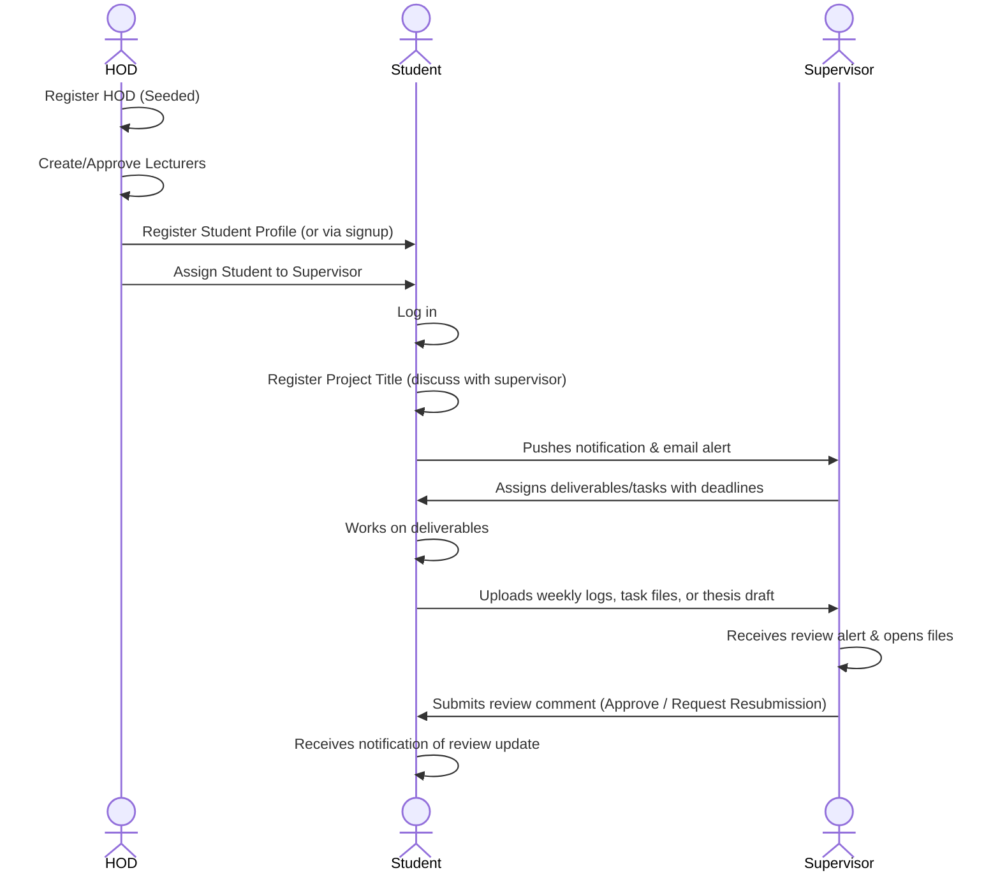

# Final Year Project (FYP) Management System — Project Documentation

Welcome to the comprehensive documentation of the **Final Year Project (FYP) Management System** for the Department of Computer Science, Ramon Adedoyin College of Natural and Applied Sciences, Oduduwa University Ipetumodu (OUI), Osun State, Nigeria.

This documentation serves as a guide for developers, system administrators, and stakeholders, detailing the system architecture, database design, file structure, key features, workflows, and deployment procedures.

---

## 📖 1. System Overview

The FYP Management System is a role-based web application designed to streamline final-year project monitoring, submissions, tasks assignment, and progress reporting. It coordinates workflows between three distinct user roles:

1. **Head of Department (HOD):** Manages registrations, allocates students to supervisors, schedules departmental activities, and monitors the overall progress ledger.
2. **Supervisors (Lecturers):** Creates tasks, reviews submissions, leaves comments/feedback, and approves or requests resubmissions for deliverables.
3. **Students:** Registers project titles, views departmental schedules, submits weekly progress logs, uploads task deliverables, and submits final drafts.

---

## 📐 2. Architecture & Database Design

The system is built on a light MVC-inspired architecture using **PHP (PDO)** for database persistence and a robust frontend stack of **HTML5, CSS3, and JavaScript**.

### Entity Relationship Diagram (ERD) Schema
The system uses a relational MySQL database containing 9 core tables:

```mermaid
erDiagram
    HOD {
        varchar No_staf PK
        varchar Nama
        varchar Katalaluan
        varchar Jawatan
        varchar Kod_aktiviti FK
        varchar Email
    }
    Supervisor {
        varchar No_staf PK
        varchar Nama
        varchar Katalaluan
        varchar Jawatan
        varchar Email
    }
    Student {
        varchar No_matrik PK
        varchar Nama
        varchar Katalaluan
        int Semester
        varchar Email
    }
    Project {
        int ID_projek PK, AI
        varchar Tajuk_Projek
        varchar No_matrik FK, UK
        varchar No_staf FK
    }
    Activity {
        varchar Kod_aktiviti PK
        time Masa
        date Tarikh
        varchar Lokasi
        varchar Jenis
    }
    Task {
        int ID_tugasan PK, AI
        varchar Jenis
        text Ulasan
        varchar Pengesahan
        date Tarikh
        date Deadline
        varchar No_matrik FK
        varchar No_staf FK
        int ID_projek FK
    }
    Submissions {
        int ID_hantaran PK, AI
        int ID_projek FK
        varchar No_matrik FK
        int ID_tugasan FK
        varchar Jenis_Hantaran
        varchar Tajuk
        text Kandungan
        varchar File_Path
        timestamp Tarikh_Hantar
        varchar Status
    }
    Comments {
        int ID_ulasan PK, AI
        int ID_hantaran FK
        varchar Pengulas_ID
        varchar Peranan_Pengulas
        text Ulasan
        timestamp Tarikh_Ulasan
    }
    Notifications {
        int ID_notifikasi PK, AI
        varchar Penerima_ID
        text Mesej
        tinyint Status_Baca
        timestamp Tarikh_Cipta
    }

    Student ||--o| Project : "has one"
    Supervisor ||--o{ Project : "supervises"
    Student ||--o{ Task : "assigned to"
    Supervisor ||--o{ Task : "assigns"
    Project ||--o{ Task : "tracks"
    Project ||--o{ Submissions : "has"
    Student ||--o{ Submissions : "submits"
    Task ||--o| Submissions : "satisfies"
    Submissions ||--o{ Comments : "contains"
```

### Table Definitions & Roles
1. **`HOD`:** Stores HOD details. Pre-seeded with a default HOD account (`HOD001` / `password123`) since HOD registration is disabled publicly for security reasons.
2. **`Supervisor`:** Stores lecturer details. Created via public registration or HOD portal.
3. **`Student`:** Stores final year student details. Created via public registration or HOD portal.
4. **`Project`:** Maps a Student to an assigned Supervisor. Contains the final year project title (`Tajuk_Projek`).
5. **`Activity`:** Departmental calendar schedule entries (e.g., orientation, synopsis, viva) managed by the HOD.
6. **`Task`:** Individual deadlines assigned by Supervisors to specific Students (e.g., Chapter 1 draft, code progress).
7. **`Submissions`:** Deliverables uploaded by Students. Categorized into `weekly` logs, custom `task` files, or the `final` thesis draft.
8. **`Comments`:** Review comments and evaluation messages left on submissions by Supervisors.
9. **`Notifications`:** System logs containing alerts pushed to users' dashboards for real-time visual notifications.

---

## 📂 3. File Structure & Component Breakdown

```
fyp_management_system/
│
├── config/
│   └── db.php                  # Database connection & Auto-Builder
│
├── db/
│   └── fyp_db.sql              # Database schema & Seed script
│
├── includes/
│   ├── functions.php           # Session, Localization helper, OB setup, Security
│   ├── lang.php                # Localization translation dictionary (EN/MS)
│   ├── header.php              # Shell top navbar & notifications loading
│   ├── footer.php              # Shell footer & Developer console
│   └── nav.php                 # Role-based sidebar menu
│
├── assets/
│   ├── css/
│   │   └── style.css           # UI layout rules, animations, mobile overrides
│   └── js/
│       └── app.js              # Password toggles, loading states, menu slide triggers
│
├── uploads/                    # Local storage directory for student files
├── logs/                       # Local directory storing simulated email logs
│
├── index.php                   # Public landing page (with live stats & logout)
├── login.php                   # Core authentication portal for all roles
├── register.php                # Public signup screen for Students and Supervisors
│
├── hod_dashboard.php           # HOD Workspace
├── hod_registration.php        # HOD user manager & student allocation
├── hod_activities.php          # HOD department calendar scheduler
├── hod_reports.php             # HOD progress reports auditor ledger
│
├── student_dashboard.php       # Student home panel
├── student_project.php         # Student title register page
├── student_submissions.php     # Student files submission dashboard
│
├── supervisor_dashboard.php    # Supervisor dashboard panel
├── supervisor_students.php     # Supervisor student logs & progress list
├── supervisor_tasks.php        # Supervisor tasks allocator form
└── supervisor_review.php       # Supervisor submissions feedback panel
```

### Module Breakdown

#### A. Configurations & Utilities
*   **[config/db.php](file:///c:/Users/Lenovo%20ThinkBook/.gemini/antigravity-ide/scratch/fyp_management_system/config/db.php):** Loads database configurations. It contains a connection parser that supports Railway's single environment variable string `MYSQL_URL` as well as individual standard keys (`MYSQLHOST`, `MYSQLDATABASE`, `MYSQLUSER`, `MYSQLPASSWORD`, `MYSQLPORT`). It includes a **Database Auto-Builder** that checks if the `HOD` table exists and is populated; if not, it automatically runs the schema from `db/fyp_db.sql`, allowing database-less deployments.
*   **[includes/functions.php](file:///c:/Users/Lenovo%20ThinkBook/.gemini/antigravity-ide/scratch/fyp_management_system/includes/functions.php):** Initializes session management. It calls `ob_start()` at the very beginning to enable output buffering, preventing header-redirect errors on cloud systems. Contains role helpers (`requireRole()`), custom alert parsers, input sanitizers, notification generators, and the simulated email dispatcher.
*   **[includes/lang.php](file:///c:/Users/Lenovo%20ThinkBook/.gemini/antigravity-ide/scratch/fyp_management_system/includes/lang.php):** Implements system translation keys for English (`en`) and Malay (`ms`). Translate strings are called globally via the localization helper `__('key_name')`.

#### B. Portal Navigation & Shells
*   **[includes/header.php](file:///c:/Users/Lenovo%20ThinkBook/.gemini/antigravity-ide/scratch/fyp_management_system/includes/header.php):** Contains the upper top navbar. Fetches unread notifications count, loads the notification alerts panel (marking read states via AJAX fetch calls in the background), and contains the language selector. On mobile, it displays the sidebar hamburger menu button.
*   **[includes/nav.php](file:///c:/Users/Lenovo%20ThinkBook/.gemini/antigravity-ide/scratch/fyp_management_system/includes/nav.php):** Sidebar containing role-based menu options.
*   **[includes/footer.php](file:///c:/Users/Lenovo%20ThinkBook/.gemini/antigravity-ide/scratch/fyp_management_system/includes/footer.php):** Closes the container tags. It houses the **Developer Email Logs Console** drawer simulator.

#### C. User Dashboards & Forms
*   **[hod_dashboard.php](file:///c:/Users/Lenovo%20ThinkBook/.gemini/antigravity-ide/scratch/fyp_management_system/hod_dashboard.php):** Displays statistics cards, unassigned students metrics, department activities, recent task distributions, and a detailed registered students list registry.
*   **[student_dashboard.php](file:///c:/Users/Lenovo%20ThinkBook/.gemini/antigravity-ide/scratch/fyp_management_system/student_dashboard.php):** Shows personal assignment metadata, tasks, current supervisor info, and direct logs summary.
*   **[supervisor_dashboard.php](file:///c:/Users/Lenovo%20ThinkBook/.gemini/antigravity-ide/scratch/fyp_management_system/supervisor_dashboard.php):** Shows current supervision load, list of assigned students, unapproved deliverables, and quick links to submit comments or create tasks.

---

## ⚡ 4. Core System Features

### 1. Global Button Loading States
To prevent double submissions and improve user experience, all buttons (`<button>`, inputs, and `.btn` classes) feature an interactive loading state defined in `assets/js/app.js`:
- Form submits intercept the `submit` event, append a spinning icon (`fa-spinner`), rewrite the text to "Please wait...", and disable the button after `10ms` (allowing the browser to complete serialization and start the submission payload).
- Standalone link buttons update to "Loading..." and disable clicks immediately, restoring themselves automatically after 3 seconds if navigation is interrupted.

### 2. Password Toggle Viewer
All password fields (`input[type="password"]`) are wrapped in a `.password-wrapper` containing an eye icon (`fa-eye`). Clicking the eye icon toggles the input type between `password` and `text`, letting users verify password inputs on the login, signup, and management portals.

### 3. Developer Simulated Email Log Console
Because local web servers (like XAMPP) do not have preconfigured SMTP configurations, the application implements a simulation environment:
- Outbox emails dispatched by actions (such as submissions, reviews, or allocations) are logged inside `logs/emails.log`.
- Injected at the bottom of the portal page is a collapsible **Developer Email Logs Console** that reads `logs/emails.log` in real time, displaying the emails in reverse chronological order for debugging.

### 4. Collapsible Mobile Menu Drawer
The sidebar navigation menu adaptively transforms on mobile devices (`max-width: 992px`):
- Pushes the menu drawer off-screen (`left: -290px`) and enables a hamburger menu button inside the top header.
- Clicking the hamburger button slides the menu in smoothly, locks the viewport scroll, and shows a background blur overlay backdrop.
- Clicking the overlay backdrop or close `[X]` button retracts the sidebar menu.
- Displays only the user avatar icon on viewports under `768px` to save screen estate.

---

## 🔄 5. Key Workflows & User Actions



### Setup Workflow (Admin / HOD)
1. Log in with HOD credentials (`HOD001` / `password123`).
2. Go to **User Management** (`hod_registration.php`) to register students and lecturers.
3. Use the **Allocate Supervisor** card to select a registered student and assign them a supervisor. This creates a record in the `Project` table.

### Project Title Registration (Student)
1. Log in as a Student.
2. Go to **Project Topic / Title** (`student_project.php`).
3. Fill in the topic title after discussing it with the assigned supervisor, and click register. The supervisor will receive a dashboard notification and email alert.

### Task Assignment & Review (Supervisor & Student)
1. Supervisor logs in and navigates to **My Students** (`supervisor_students.php`).
2. Clicks **Assign New Task** (`supervisor_tasks.php`) to set a task type and deadline.
3. Student receives a notification, uploads the file via **Tasks & Submissions** (`student_submissions.php`).
4. Supervisor opens **Submissions Ledger**, clicks **Review** (`supervisor_review.php`) to read/download, enters feedback, and updates the task status (Approved or Resubmit).

---

## 🚀 6. Installation & Deployment Guide

### Local Server Setup (XAMPP / WAMP)
1. **Copy Files:** Place the folder `fyp_management_system` in your web root directory (e.g., `C:\xampp\htdocs\fyp_management_system`).
2. **Start Services:** Start **Apache** and **MySQL** modules inside the XAMPP Control Panel.
3. **Database Configuration:** 
   - Open phpMyAdmin (`http://localhost/phpmyadmin/`).
   - Create a database named `fyp_management_system`.
   - The application **Auto-Builder** will run the schema on the first page load, or you can import `db/fyp_db.sql` manually.
4. **Access the App:** Open the URL:
   `http://localhost/fyp_management_system/index.php`

### Production Server Setup (Railway Cloud)
1. **Link Repository:** Create a new project on Railway and link the GitHub repository: `tolu3025/fyp-management-system`.
2. **Add MySQL Database:** Add a MySQL Database service in your Railway project panel.
3. **Automatic Environment Mapping:** Railway automatically creates environment variables (`MYSQLHOST`, `MYSQLDATABASE`, `MYSQLUSER`, `MYSQLPASSWORD`, `MYSQLPORT`). The application will read these variables inside `config/db.php` and connect to the database.
4. **Auto-Builder:** The application detects the empty database on the first request and runs `db/fyp_db.sql` automatically, creating all tables and seeding default accounts. No manual configuration is required.
